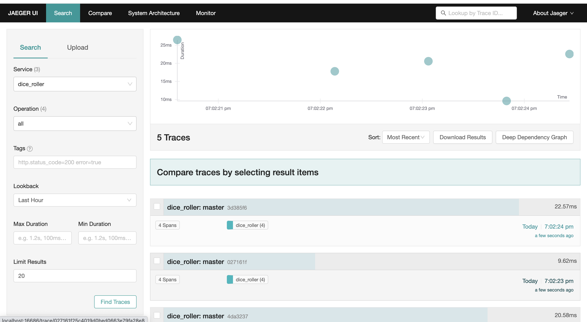
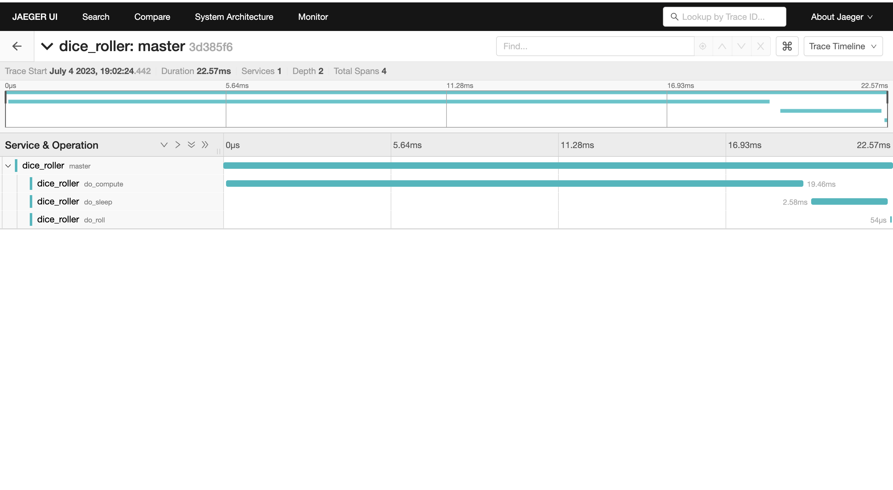
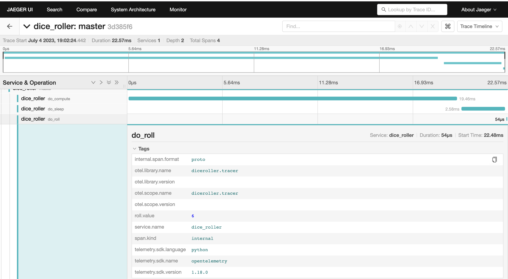
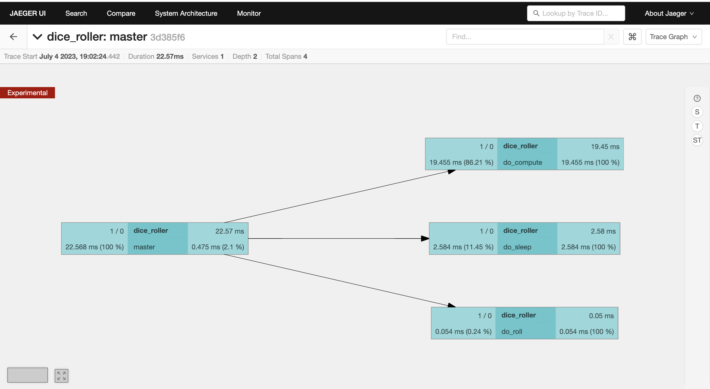

# telemetry-python-learning
Learning open telemetry 

## Concepts
* Traces: Path of request
* Span: Workers inside a trace.
* Each request will have a trace id and associated span ids.
* Metrics are time based stats

## Steps to follow
### Install Docker in system
### Enable apps
* `flask --app app.py run -p 8080`
* `flask --app app_2.py run -p 8081`
### Enabling jaeger collector
* run `./start_jaeger.sh`
* check the [url](http://localhost:16686) to access jaeger ui.
* Jaeger ui with traces

* A trace showing multiple spans

* Attributes of a span

* Span tree in a trace

## Additional docs
### Automatic instrument
* Install additional `opentelemetry-bootstrap -a install`
* Runnig the application `opentelemetry-instrument --traces_exporter console --metrics_exporter console --logs_exporter console flask run -p 8080`
* Or, Run the via `opentelemetry-instrument --traces_exporter console --metrics_exporter console flask run -p 8080`
### Analyzing a automatic instrument
```
127.0.0.1 - - [26/Jun/2023 12:08:17] "GET /rolldice HTTP/1.1" 200 -
{
    "name": "/rolldice",
    "context": {
        "trace_id": "0x946cc5f15dc075dc5c1681b1cf7b1f4b",
        "span_id": "0x98ca65dcd0f2736b",
        "trace_state": "[]"
    },
    "kind": "SpanKind.SERVER",
    "parent_id": null,
    "start_time": "2023-06-26T06:38:17.975479Z",
    "end_time": "2023-06-26T06:38:17.976359Z",
    "status": {
        "status_code": "UNSET"
    },
    "attributes": {
        "http.method": "GET",
        "http.server_name": "127.0.0.1",
        "http.scheme": "http",
        "net.host.port": 8080,
        "http.host": "127.0.0.1:8080",
        "http.target": "/rolldice",
        "net.peer.ip": "127.0.0.1",
        "http.user_agent": "Mozilla/5.0 (Macintosh; Intel Mac OS X 10_15_7) AppleWebKit/537.36 (KHTML, like Gecko) Chrome/114.0.0.0 Safari/537.36",
        "net.peer.port": 49913,
        "http.flavor": "1.1",
        "http.route": "/rolldice",
        "http.status_code": 200
    },
    "events": [],
    "links": [],
    "resource": {
        "attributes": {
            "telemetry.sdk.language": "python",
            "telemetry.sdk.name": "opentelemetry",
            "telemetry.sdk.version": "1.18.0",
            "telemetry.auto.version": "0.39b0",
            "service.name": "unknown_service"
        },
        "schema_url": ""
    }
}
{
    "resource_metrics": [
        {
            "resource": {
                "attributes": {
                    "telemetry.sdk.language": "python",
                    "telemetry.sdk.name": "opentelemetry",
                    "telemetry.sdk.version": "1.18.0",
                    "telemetry.auto.version": "0.39b0",
                    "service.name": "unknown_service"
                },
                "schema_url": ""
            },
            "scope_metrics": [
                {
                    "scope": {
                        "name": "opentelemetry.instrumentation.flask",
                        "version": "0.39b0",
                        "schema_url": ""
                    },
                    "metrics": [
                        {
                            "name": "http.server.active_requests",
                            "description": "measures the number of concurrent HTTP requests that are currently in-flight",
                            "unit": "requests",
                            "data": {
                                "data_points": [
                                    {
                                        "attributes": {
                                            "http.method": "GET",
                                            "http.host": "127.0.0.1:8080",
                                            "http.scheme": "http",
                                            "http.flavor": "1.1",
                                            "http.server_name": "127.0.0.1"
                                        },
                                        "start_time_unix_nano": 1687761279493246000,
                                        "time_unix_nano": 1687761504393315000,
                                        "value": 0
                                    }
                                ],
                                "aggregation_temporality": 2,
                                "is_monotonic": false
                            }
                        },
                        {
                            "name": "http.server.duration",
                            "description": "measures the duration of the inbound HTTP request",
                            "unit": "ms",
                            "data": {
                                "data_points": [
                                    {
                                        "attributes": {
                                            "http.method": "GET",
                                            "http.host": "127.0.0.1:8080",
                                            "http.scheme": "http",
                                            "http.flavor": "1.1",
                                            "http.server_name": "127.0.0.1",
                                            "net.host.port": 8080,
                                            "http.status_code": 200
                                        },
                                        "start_time_unix_nano": 1687761279494998000,
                                        "time_unix_nano": 1687761504393315000,
                                        "count": 8,
                                        "sum": 9,
                                        "bucket_counts": [
                                            0,
                                            8,
                                            0,
                                            0,
                                            0,
                                            0,
                                            0,
                                            0,
                                            0,
                                            0,
                                            0,
                                            0,
                                            0,
                                            0,
                                            0,
                                            0
                                        ],
                                        "explicit_bounds": [
                                            0.0,
                                            5.0,
                                            10.0,
                                            25.0,
                                            50.0,
                                            75.0,
                                            100.0,
                                            250.0,
                                            500.0,
                                            750.0,
                                            1000.0,
                                            2500.0,
                                            5000.0,
                                            7500.0,
                                            10000.0
                                        ],
                                        "min": 1,
                                        "max": 2
                                    }
                                ],
                                "aggregation_temporality": 2
                            }
                        }
                    ],
                    "schema_url": ""
                }
            ],
            "schema_url": ""
        }
    ]
}
^C{
    "resource_metrics": [
        {
            "resource": {
                "attributes": {
                    "telemetry.sdk.language": "python",
                    "telemetry.sdk.name": "opentelemetry",
                    "telemetry.sdk.version": "1.18.0",
                    "telemetry.auto.version": "0.39b0",
                    "service.name": "unknown_service"
                },
                "schema_url": ""
            },
            "scope_metrics": [
                {
                    "scope": {
                        "name": "opentelemetry.instrumentation.flask",
                        "version": "0.39b0",
                        "schema_url": ""
                    },
                    "metrics": [
                        {
                            "name": "http.server.active_requests",
                            "description": "measures the number of concurrent HTTP requests that are currently in-flight",
                            "unit": "requests",
                            "data": {
                                "data_points": [
                                    {
                                        "attributes": {
                                            "http.method": "GET",
                                            "http.host": "127.0.0.1:8080",
                                            "http.scheme": "http",
                                            "http.flavor": "1.1",
                                            "http.server_name": "127.0.0.1"
                                        },
                                        "start_time_unix_nano": 1687761279493246000,
                                        "time_unix_nano": 1687761538772159000,
                                        "value": 0
                                    }
                                ],
                                "aggregation_temporality": 2,
                                "is_monotonic": false
                            }
                        },
                        {
                            "name": "http.server.duration",
                            "description": "measures the duration of the inbound HTTP request",
                            "unit": "ms",
                            "data": {
                                "data_points": [],
                                "aggregation_temporality": 2
                            }
                        }
                    ],
                    "schema_url": ""
                }
            ],
            "schema_url": ""
        }
    ]
}
```


## Links:
* Open telemetry python api [link](https://opentelemetry.io/docs/instrumentation/python/).
* Jaerger getting started [link](https://www.jaegertracing.io/docs/1.46/getting-started/).
* integration tutorial [link](https://www.aspecto.io/blog/getting-started-with-opentelemetry-python/).
* Open telemetry [concepts](https://opentelemetry.io/docs/concepts/).
